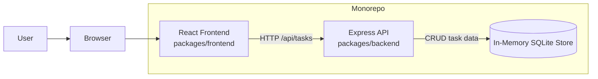
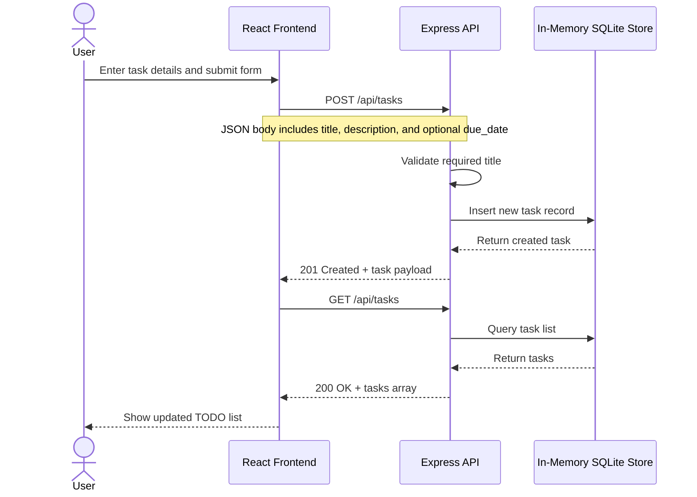

# Cloud Architecture Overview

This monorepo contains a browser-based React frontend, an Express backend API, and an in-memory SQLite store used by the backend for task data.

## Create TODO Sequence

